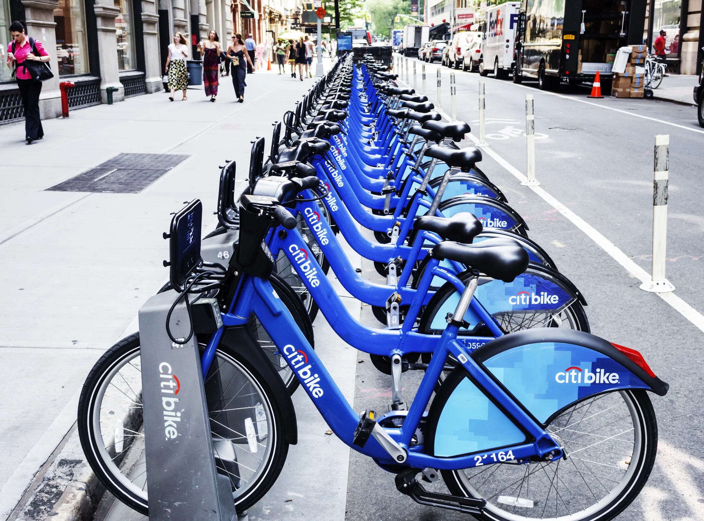

# Tableau-challenge

# **Project Description: Data Visualization of Citi Bike Analytics**

**Overview:**
As the new lead analyst for the New York Citi Bike Links to an external site. program, you are now responsible for overseeing the largest bike-sharing program in the United States. In your new role, you will be expected to generate regular reports for city officials looking to publicize and improve the city program.

**Data Source:**
Monthly CSV file were collected from Citi Bike Data webpage.

**Visualizations:**
https://public.tableau.com/app/profile/pawanpreet.dhillon/viz/NYCitiBike_17145833769090/Story1?publish=yes

**Analysis**
--------------------------------------------------
**Busiest Times and Days**
The cumulative records surpassed 65,000, indicating a strong preference for both electric and traditional bicycles. Analysis suggests that the period around mid-March 2024 experienced the highest rider activity. A heatmap illustrates that bike usage peaked during the beginning and ending of typical office hours, 9 am to 5 pm. Specifically, the hours between 7 am to 9 am and 5 pm to 7 pm witnessed the highest frequency of rides from Mondays to Fridays. Sundays exhibited a distinct pattern, with sustained activity observed from 10 am to 6 pm. Saturdays emerged as the least active day in comparison.

----------------------------------

**Popular Station**

Hoboken Terminal (HB102) and Grove St Path (JC115) are typically the most crowded stations, drawing the highest number of commuters who initiate their journeys, with more than 3,000 rides recorded in March. Additionally, other stations in proximity to the Waterfront, such as Exchange Place, Newport Path, Newport Parkway, and 14 St Ferry, also see significant popularity.
-------------

**Distance Covered**

The longest distance traveled from Hoboken was approximately 2500 km by a total of 3275 riders, while from Grove St, around 2000 km were covered by 3100 riders. In comparison, City Hall saw a distance of 1200 km traveled by a total of 1700 riders.
-------------------

